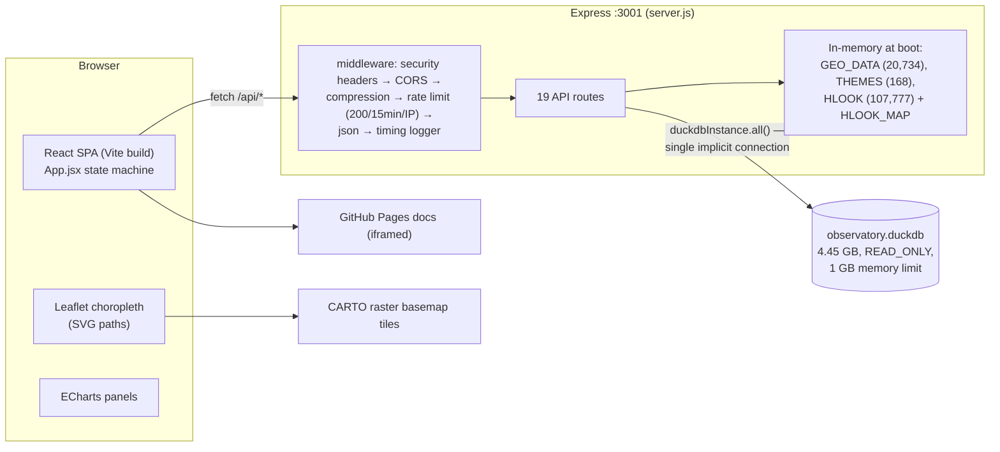

# UNI·CEN Canadian Census Observatory — Application Specification

*Written 2026-08-09 against app version 0.6.0, and updated the same day after the performance remediation described in [PERFORMANCE.md](PERFORMANCE.md) §7 (geometry/values API split, client-side percent, restyle-in-place, HTTP caching, bundle split). Response shapes were captured from the running server, not inferred from code.*

## 1. Overview

The Canadian Census Observatory is a single-page web application for exploring Canadian census data from 1951–2021. The user selects a **geography** (census tract, subdivision, division, metropolitan area, or province), a **theme** (e.g. "Age - By cohort"), a **variable** within that theme, and a **year**. The app renders:

- a national **choropleth map** at the selected geography's level, colored by decile bins of the selected variable;
- a **"Selected geographies profile"** panel comparing the focal geography against an optional comparison geography (stacked/ordinal bar chart or histogram depending on variable type);
- a **"Change over time"** panel showing the variable's longitudinal series for the focal (and comparison) geography.

| Layer | Technology |
|---|---|
| Backend | Node.js (ESM), Express 5, `@duckdb/node-api` 1.5 (DuckDB "Node Neo", 3-connection pool), `wkx` (WKB→GeoJSON), `compression`, `express-rate-limit`, `cors`, `dotenv` |
| Data store | Single 4.45 GB DuckDB file, opened `READ_ONLY` with a 1 GB memory limit, plus three JSON sidecar files loaded into memory at boot |
| Frontend | Vite 7, React 19, react-leaflet 5 / Leaflet 1.9 (SVG renderer), ECharts 6, Mantine 9 UI components |
| Deployment | Render (single service serving both API and built frontend), behind Cloudflare — https://unicen-observatory-js.onrender.com |

## 2. Repository layout

```
unicen_js/
├── readme.rtf                  # 4-step run instructions (only pre-existing doc)
├── .claude/launch.json         # dev launch config: backend :3001, frontend :5173
├── .git/                       # BROKEN — HEAD and index are 0 bytes; repo is effectively unversioned
├── backend/
│   ├── server.js               # the entire backend: middleware, all 17 routes, all SQL (1,657 lines)
│   ├── package.json            # no start script; `npm test` exits 1
│   ├── .env                    # PORT, ALLOWED_ORIGINS + leftover unused RDS Postgres credentials
│   ├── .ssh/                   # private SSH keys (should not live in the app tree)
│   └── data/
│       ├── observatory.duckdb  # 4.45 GB — all census facts, geometry, hierarchy
│       ├── geos.json           # 1.77 MB, 20,734 rows — geography search index (loaded at boot)
│       ├── themes.json         # 19 KB, 168 theme definitions (loaded at boot)
│       ├── hlook.json          # 44.7 MB, 107,777 rows — geography hierarchy (loaded at boot, "legacy" fallback for the hlook DuckDB table)
│       ├── all_descr.csv       # 5 MB — unreferenced by code (upstream R pipeline artifact)
│       └── theme_yr.csv        # 134 KB — unreferenced by code
└── frontend/
    ├── vite.config.js, eslint.config.js
    ├── public/positron.json    # unused MapLibre style (app uses CARTO raster tiles)
    └── src/
        ├── App.jsx             # app shell, all state (useReducer), all data-fetching/orchestration useEffects (~1,600 lines)
        ├── ChoroplethMap.jsx   # Leaflet map, decile binning, inferno palette, hover tooltip, legend (818 lines)
        ├── CatPlot.jsx         # ECharts stacked bar — categorical themes (t_type cat/catm)
        ├── OrdPlot.jsx         # ECharts ordinal bar — ordinal themes (ord/ordc)
        ├── NCPlot.jsx          # ECharts histogram — non-count themes (nc)
        ├── LongitudinalPlot.jsx# ECharts time series ("Change over time")
        ├── FloatingCard.jsx    # draggable/collapsible overlay card
        ├── config.js           # colors, APP_VERSION, hover delay
        ├── pages/About.jsx, Documentation.jsx  # <iframe> to zacktayloruwo.github.io/unicen_observatory
        └── old/ChoroplethMap.jsx  # dead code (not imported)
```

## 3. Architecture



- In development the SPA runs on Vite (:5173) and calls the API cross-origin at `http://localhost:3001` (`API_BASE`, [App.jsx:34](../frontend/src/App.jsx)). In production Express serves `frontend/dist` itself with an SPA catch-all ([server.js:1637](../backend/server.js)), so `API_BASE` falls back to `window.location.origin`.
- All DuckDB access goes through **`@duckdb/node-api`** ("Node Neo", the maintained successor to the legacy `duckdb` package; migrated 2026-08-09) via the promise-based `duckAll()` helper and a **fixed pool of 3 connections**, so cheap lookups run alongside heavy queries instead of queueing behind them. `duckAll()` normalizes Neo's value types (BigInt → number, `DuckDBBlobValue` → Buffer) so route code works with plain JS values.
- The server starts listening only after `loadHlook()` resolves (~0.5 s boot). `loadHlook()` prefers a DuckDB `hlook` table and falls back to the 44.7 MB `hlook.json` if the table isn't present; the query now projects only the columns the server uses (`geosid, year, level, geoname, prname, prabbr, pruid, cmaname`) instead of `SELECT *`, so this is a no-op cost change whichever source is active. **Still pending, as of 2026-08-09:** the deployed `observatory.duckdb` (and the latest pipeline build checked, `unicen-js-data-prep/output/observatory.duckdb` dated 2026-06-10) has *no* `hlook` table — nor `geoms`, `all_descr`, or `look_tylg`; that build contains only the five fact tables (`ct/csd/cd/cma/pr`), i.e. it's a partial pipeline run, not a full rebuild. The app is unaffected today because it's still running against the older, complete 4.45 GB DB via the JSON fallback — but that older DB is what's live, not the newer partial one. Once the R pipeline produces a full rebuild containing `hlook` (and confirms `geoms`/`all_descr`/`look_tylg` are also present), deploy it and `hlook.json` can be deleted and untracked (it is a 44.7 MB git-tracked file that predates its `.gitignore` entry and can drift from the DB build).

## 4. Data model

### 4.1 DuckDB tables

| Table | Contents |
|---|---|
| `ct`, `csd`, `cd`, `cma`, `pr` | Fact tables, one per geography level: one row per (geosid, time, t_code) with `value` |
| `geoms` | Geometry per (geosid, level, time) as WKB blobs; `time` is **VARCHAR** |
| `all_descr` | Variable labels: (t_theme, t_code, t_name, t_level, t_denom, t_type, weight…) |
| `hlook` | Geography hierarchy/metadata: one row per (geosid, census cycle) with names, province, parent links (~25 columns) |

### 4.2 Identifier conventions

- **`geosid`** — geography ID. Provinces are 2 digits (`35` = Ontario), census divisions 4 (`3520`), subdivisions 7 (`3506008` = Ottawa), CMAs 3 (`535` = Toronto), census tracts are decimal strings (`5350001.00`).
- **`level`** — 1 = CT, 2 = CSD, 3 = CD, 4 = CMA, 5 = PR. Fact table per level: `ct`/`csd`/`cd`/`cma`/`pr`.
- **`t_theme`** — 4-char theme code (`agec`, `dnk2`…), 168 defined in themes.json.
- **`t_code`** — variable code, prefixed by its theme (`agec0004`, `agec_avg`, `dnk2`).
- **`t_level`** — role of a variable within its theme: `0` = denominator, `1` = category, `-1` = standalone.
- **`t_denom`** — the t_code of a variable's denominator (used for `value_mode=percent`).
- **`t_type`** — theme type driving which panel renders: `cat`/`catm` (categorical → CatPlot), `ord`/`ordc` (ordinal → OrdPlot), `nc` (non-count, e.g. averages/densities → NCPlot histogram; percent mode disabled).
- **`time`** — census year (1951–2021, 5-year cycles).

### 4.3 Sidecar JSON files (loaded at boot)

- `geos.json` → `GEO_DATA`: `{geosid, label}` rows powering `/api/geos` substring search.
- `themes.json` → `THEMES` + `THEME_BY_ID` map: theme definitions.
- `hlook.json` → `HLOOK` array + `HLOOK_MAP` (keyed `geosid|year`) + `HLOOK_YEARS`: geography metadata used to resolve names, levels, and per-cycle geosid continuity. Legacy fallback only — superseded by a `hlook` DuckDB table once one is deployed (see §3).

## 5. Backend endpoint catalog

All endpoints are GET, return JSON, and sit behind the shared middleware stack (§7). Latency/payload numbers are in [PERFORMANCE.md](PERFORMANCE.md).

### Selection-cascade endpoints (small, fast)

| Endpoint | Params | Response (captured) | Called when |
|---|---|---|---|
| `/api/ping` | — | `{ok: true}`-style liveness | (diagnostics) |
| `/api/geos` | `q` (substring) | `[{geosid, label}]` | user types in either geography search box (300 ms debounce) |
| `/api/level` | `year, geosid` | `{year, geosid, level, geoname, prabbr, prname}` | focal geography or year changes |
| `/api/geoyears` | `geosid` | `[1976, 1981, …]` — census years the geography exists | focal geography changes |
| `/api/themes` | `level, year` | `[{t_theme, t_themedescr, t_type}]` | level/year changes. `Cache-Control: public, max-age=3600` |
| `/api/years` | `level, t_theme` | `["1951", …]` | theme changes. Cached 1 h |
| `/api/codes` | `level, t_theme, year` | `[{t_code, t_name, t_level}]` | theme/year changes. Cached 1 h |
| `/api/code-years` | `level, t_code` | `{census: [1961, …], available: [2011, …]}` — census years at this level, and the subset carrying this variable | variable changes; feeds the Year coverage strip. Cached 1 h |
| `/api/ct-cma` | `year` | `{year, names: {<ct geosid>: "<CMA name>"}}` — every census tract that year and the metro area it sits in (6,247 entries for 2021, ~19 KB gz) | only while the CT level is showing; names tract popups. In-memory filter over `HLOOK`. Cached 24 h |

### Map endpoints

| Endpoint | Params | Response (captured) |
|---|---|---|
| `/api/geometry` | `level, year` | Geometry-only GeoJSON FeatureCollection for the whole level/year; per-feature `properties`: `{geosid, geoname, prname}`. Built once per (level, year) — WKB parse + stringify — then served from an LRU-capped in-memory cache with a manual ETag and `Cache-Control: public, max-age=86400, stale-while-revalidate=604800`. 1.1–12.6 MB raw / 0.4–3.6 MB gz depending on level |
| `/api/values` | `level, year, t_code` | Data-only: `{t_code, level, year, t_level, t_denom, rows: [{geosid, raw_value, denom_value}]}` (~30–100 KB gz). The client joins by geosid and derives percent locally (`raw*100/denom`), so the percent/absolute toggle needs no request. `t_denom` sentinel values (`"noncount"`) are normalized to null. Cached 1 h |
| `/api/boundaries` | `level` (default 5), `year` | Same payload as `/api/geometry` (served from the same cache); kept for the province-overlay fetch |
| `/api/geo-polygon` | `geosid, year` | Single-geography GeoJSON (focal/comparison highlight outline). Falls back across census cycles via HLOOK when the exact year has no geometry. Cached 24 h |
| `/api/map-data` | `level, year, t_theme, t_code, value_mode` | **Legacy** — geometry + values coupled in one multi-MB response. No longer called by the frontend; retained for clients running an old bundle |

### Panel endpoints (small, fast)

| Endpoint | Params | Response (captured) |
|---|---|---|
| `/api/cs-plot` | `level, year, t_theme, geosid, ref_geosid?` | `{supported, type, t_theme, themeLabel, t_type, level, year, focal: {geosid, label}, ref: {…}, categories: [{t_code, t_name, focal_pct, ref_pct}]}` — categorical comparison. Focal and ref queries run in parallel (`Promise.all`) |
| `/api/os-plot` | same | `{categories: [names…], focal: […], ref: […]}` — ordinal comparison |
| `/api/nc-ref-value` | `geosid, year, t_code, value_mode` | `{value, raw_value, denom_value}` — reference line for the histogram |
| `/api/series` | `focal_geosid, ref_geosid?, year, t_code, value_mode` | `{focal: {geosid, level, label, series: [{time, value}]}, ref: {…}}` — longitudinal panel. Focal and ref run in parallel; results are deduplicated by time and filtered by level (the source tables can carry duplicate rows per (geosid, time, t_code)); hlook lookups are O(1) via HLOOK_MAP |

### Dead endpoints (implemented, never called by the frontend)

- `/api/meta` (`year, geosid` → `{level, geoname}`) — superseded by `/api/level`.
- `/api/topics` (`level` → theme list with `weight`) — superseded by `/api/themes`.
- `/api/ref-options` — full HLOOK filter+sort per request; the most expensive lookup handler in the file, but unreachable from the current UI.

## 6. Frontend structure

### 6.1 State and data flow

All state lives in a single `useReducer` in [App.jsx](../frontend/src/App.jsx) (focal/ref geography, level, year, theme, code, valueMode, UI flags). `useEffect` hooks orchestrate fetching; every data fetch carries an `AbortController` so superseded requests are cancelled instead of racing.

The selection cascade:

```
geosid → /api/level → /api/themes → /api/years → /api/codes → /api/geometry + /api/values + panels + /api/series
```

Map data arrives in two independent pieces:

- **`geometryPayload`** — fetched per (level, year), kept in a small client-side LRU cache (plus the browser HTTP cache honors the server's 24 h max-age), so revisiting a level is instant and variable changes never re-download geometry.
- **`valuesPayload`** — fetched per (level, year, t_code); `displayValues` (a `useMemo`) joins rows to geosids and derives the displayed value from `raw_value`/`denom_value` according to `effectiveValueMode`. The percent/absolute toggle is therefore pure client-side math.

Cascade-consistency guards: `levelFor` records which geosid the current `state.level` was resolved for, and map/plot fetch effects skip while they disagree (prevents wrong-level requests mid-transition); `setTheme` clears `t_code`/`codeLevel`, and `codeOptions` is cleared eagerly when its inputs change so the default-code effect can't resurrect the previous theme's variable.

### 6.2 Components

- **ChoroplethMap.jsx** — react-leaflet map with CARTO raster basemap (**requires an API key** — see "Basemap key" below). Receives `geometry` (static FeatureCollection) and `values` (Map of geosid → displayed value) separately. The `<GeoJSON>` layer's key is `level-year` only, so the layer persists across variable/mode changes and is restyled in place via `layer.setStyle`; decile breaks are computed in a `useMemo` over the values map. Hover tooltips and click callbacks read *current* values/props through a ref (`hoverCtxRef`) at event time, so content stays correct without rebinding handlers. Clicking a polygon selects the focal geography; **Shift+click sets it as the comparison geography** (Shift+clicking the current comparison clears it) without moving the viewport — Leaflet's Shift+drag box zoom is disabled so the gesture can't be misread. Inferno color scale, legend, focal/ref outline overlays from `/api/geo-polygon` and `/api/boundaries`.
- **CatPlot / OrdPlot / NCPlot** — the "Selected geographies profile" card; chosen by `t_type`. NCPlot consumes a lightweight `rows` array (geosid/geoname/value) rather than GeoJSON. Each still disposes/recreates its ECharts instance on dependency change (cheap at these data sizes).
- **LongitudinalPlot** — "Change over time" card fed by `/api/series`.
- **PlotsTray** — the docked, collapsible tray along the bottom of the map hosting both plots side by side. Collapsed it is a 38 px summary line (focal geography, its value, variable and year), so the reading survives with the plots put away; it is absolutely positioned over the map rather than shrinking it, so toggling costs no Leaflet reflow. Replaced the two draggable `FloatingCard`s, which covered the right third of the map.
- **YearCoverage** — the coverage strip that flies out beside the Year pulldown, fed by `/api/code-years`. Every census year is a dot on a real-time axis (blue where the variable has a value, grey and inert where it does not); the selectable years are HTML buttons that stagger above and below the line when they collide. Answers "for this variable, which years do I have?", which a pulldown structurally cannot.
- **pages/About, pages/Documentation** — iframes to the external GitHub Pages site, loaded via `React.lazy` so they're excluded from the main chunk.
- **echartsCore.js** — shared tree-shaken ECharts build (`echarts/core` + bar/line charts + grid/tooltip/legend/markLine + canvas renderer); the only ECharts import path.

### 6.3 Bundle

Production build (Vite 7) with `manualChunks`: **echarts 557 KB (188 KB gz) + index 233 KB (74 KB gz) + mantine 194 KB (60 KB gz) + leaflet 154 KB (45 KB gz)** ≈ 1,139 KB total (366 KB gz), plus 229 KB CSS (38 KB gz) — down from a single 1,706 KB (551 KB gz) chunk. Vendor chunks are content-hashed and served with `Cache-Control: immutable`, so app-code changes don't invalidate them. Formerly-unused dependencies (`maplibre-gl`, `@maplibre/maplibre-gl-leaflet`, `recharts`, frontend `wkx`/`buffer`; backend `buffer`) have been removed, along with the dead `rowToFeature` helper and `src/old/`. (`@duckdb/node-api` was also removed as unused at the time, then deliberately re-adopted when the backend migrated off the legacy `duckdb` package.)

## 7. Cross-cutting server behavior

Middleware order ([server.js:169–224](../backend/server.js)): `trust proxy = 1` → security headers (`nosniff`, `DENY`, referrer policy, no `x-powered-by`) → CORS allowlist (`ALLOWED_ORIGINS`, default `http://localhost:5173`) → `compression()` (gzip all responses) → **rate limit: 200 requests / 15 min / IP** (in-memory store; keyed on `X-Forwarded-For` because of trust proxy) → `express.json()` → timing logger (`[timing] METHOD /path?qs → status (Nms)` on every request).

Error handling: all routes funnel through `handleError()` (generic 500, full error server-side only). Input validation is still inconsistent: `/api/codes` checks `VALID_THEMES`, but `t_code` on the data endpoints is unvalidated (parameterized SQL, so injection-safe, but arbitrary input reaches queries).

Static serving: `express.static("../frontend/dist")` — hashed files under `assets/` get `Cache-Control: public, max-age=31536000, immutable`; everything else (including the SPA catch-all `index.html`) gets `no-cache`.

## 8. Configuration & deployment

| Env var | Purpose |
|---|---|
| `PORT` | API port (default/current 3001) |
| `ALLOWED_ORIGINS` | comma-separated CORS allowlist; warns at boot if unset in production |
| `NODE_ENV` | `production` silences diagnostic logging |
| `DUCKDB_PATH` / memory settings | DuckDB file location and 1 GB memory cap (see `server.js` boot section) |
| `VITE_API_BASE` (frontend) | overrides API origin; defaults to `localhost:3001` in dev, same-origin in prod |
| `DB_HOST/DB_NAME/DB_USER/DB_PASSWORD/DB_SSL` | **leftover AWS RDS Postgres credentials — unused by any code; should be removed and the password rotated** |

Run locally: `node server.js` in `backend/` (≈1 s to ready), `npm run dev` in `frontend/`. Production: Render runs the backend, which serves the built SPA; Cloudflare fronts it (currently with `cf-cache-status: DYNAMIC` — no edge caching).

## 9. Known limitations, dead code, and hygiene

Resolved on 2026-08-09:
- **Version control restored** — the local `.git` had been truncated to 0-byte files by Dropbox sync; full history was re-fetched from the private GitHub remote `zacktayloruwo/unicen-observatory-js`, and Dropbox-regressed files (`frontend/index.html`, `maple-leaf.svg`, `backend/package.json` scripts, lockfiles) were restored from `origin/main`.
- **Unused RDS credentials removed** from `backend/.env` (never committed to git; **rotate the password anyway** — it sat in a synced folder).
- **SSH keys untracked** — `backend/.ssh/` is now gitignored, but the private keys remain in old commits on GitHub: **treat those keypairs as compromised and regenerate them**.
- Dead deps, `src/old/`, and `rowToFeature` removed; `/api/series` duplicates fixed (dedupe + level filter).

Changed on the `redesign/interface-v2` branch:
- **Contrast** — `--mantine-color-dimmed`, `--mantine-color-placeholder` and `--mantine-color-disabled-color` are overridden in `main.jsx` (all three measured 2.07–3.32:1 on white); input borders move from gray-4 to `#868e96`. Selection colours are now two-toned: `seriesColors(colorScheme)` in `config.js` returns dark ink tones in light mode and the original bright tones in dark mode, where the ink tones would fail. Map outlines always use the bright tone.
- **Footer bar removed**; version, data date and basemap credit moved to the foot of the selector panel. `ChoroplethMap` takes `showAttribution` and renders a corner credit when the panel is collapsed, so the ODbL/CARTO attribution is never absent.
- **Legend** moved to top-left and made opaque; the zoom cluster and zoom-to-national control moved to `topright`.
- **Dead code**: `src/index.css` and `src/App.css` are Vite scaffolding and are imported nowhere — contrast overrides that cannot be theme tokens live in `src/theme.css` instead. `FloatingCard.jsx` deleted.

Remaining:
- **No tests** anywhere (backend `npm test` is `exit 1`); no backend lint/CI; only doc besides `docs/` is `readme.rtf`.
### Basemap key

CARTO began requiring an API key on its raster basemaps in 2026. An unkeyed request still returns **HTTP 200 with a valid PNG** — the refusal is painted into the image as "API KEY REQUIRED" across every tile — so a broken basemap cannot be detected from the response status, headers, or the network panel, only from the rendered map. `ChoroplethMap` logs a one-time console warning when no key is configured.

The key is set as `VITE_CARTO_KEY` in `frontend/.env` (gitignored; see `frontend/.env.example`) and appended by `cartoTileUrl()` in `config.js` as `?key=…`. It is **not a secret**: the browser makes every tile request, so Vite compiles the value into the bundle and any visitor can read it. Restrict it by domain in the CARTO dashboard instead. Free within CARTO's fair-use limit of 5M tile requests/month — https://carto.com/basemaps/apikey/

Note for planning: CARTO is phasing out raster basemaps and has said it may stop updating their data, so the cartography will drift. The recommended migration is to vector basemaps, which the same key covers.

- **Dead code**: endpoints `/api/meta`, `/api/topics`, `/api/ref-options` (unreachable from the UI); legacy `/api/map-data`; `public/positron.json`; `backend/data/all_descr.csv` + `theme_yr.csv`.
- `geoms.time` is VARCHAR; `/api/geometry`/`/api/geo-polygon` pass the year as a string, legacy `/api/map-data` still passes a number (implicit cast).
- Geometry is unsimplified for national-zoom display (13 provinces = 4.2 MB raw) — see PERFORMANCE.md F7, deliberately not addressed.
